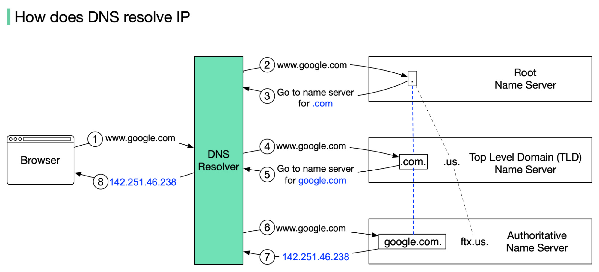

# Cloud Computing and Security notes

---

## Intro

- on-demand delivery of IT resources over the Internet on a pay-as-you-go model
- AWS
- uses
    - data backup
    - disaster recovery
    - email
    - S/W dev and testing
    - big data analytics
- benefits
    - agility
        - easy access to a broad range of tech
    - elasticity
        - don't need to over provision resources up front to handle more load in the future
        - can easily scale resources up and down as business needs change
    - cost savings
        - can treat fixed expenses such as data centers for varibale expenses, which is a lot cheaper due to difference in scale
    - deploy globally
        - can expand to new geo locations + deploy in mins

## Cloud Delivery Models

- IaaS(infra as a service)
    - basic building blocks for cloud IT
    - examples
        - networking features
        - comps(virtual/dedicated H/W)
        - data storage space
    - highest level of flexibility and control over resources
- PaaS(platform as a service)
    - remove the need for orgs to manage udnerlying infra(H/W, OS, etc.)
    - provides pre-configed envs for development/deployment
    - examples
        - middleware
        - runtime envs
        - database
    - built on top of IaaS; more abstraction, less flexibility than IaaS
- SaaS(S/W as a service)
    - S/W apps run and managed by vendor
    - not needed to worry about maintenance or underlying arch of S/W; only about its usage
    - examples
        - web-based email

## Bare Metal Servers vs Hypervisors

### Bare Metal Servers

- physical server with tangible components like RAM, CPU, etc.\
- performance
    - optimized performance + resource utilization; direct access to components
    - ideal for high performance apps like databases and real-tiem analytics
- security
    - preferred for secure apps since there is no intermediary layer, removing an additional attack surface

### Hypervisor

- S/W layers created a separation b/w H/W components and OS; creates many VMs
- flexibility + isolation
    - ideal for testing envs requiring isolation b/w workloads
- resource sharing
    - amongst multiple VMs; resource efficiency
- ease on mgmt
    - ease of managing VMs

---

- bare metal servers become more powerful when a hypervisor is added
- multiple VMs run isolated from each other parallelly

## On Premises vs On Cloud

### On Premises

- use to running of app done inside + backup, privacy, updates, etc. must be managed in-house
- complete ownershp
- additional power labourers, database prog, OS, etc. required

### On Cloud

- delivery of on-demand computing services over the Internet in a cost-effective manner

---

- the difference
    - scalability
        - on premises - difficult to scale up and down as the needs change; more expensive
        - on cloud - easier + faster to scale up and down; pay as per usage
    - server storage
        - on premises - more space, power and maintenance to store
        - on cloud - provider manages storage and its requirements
    - data security
        - on-premises - less secure as it is up to the owner
        - on-cloud - far more secure
    - data loss/recovery
        - on-premises - in case of loss, recovery is little to none in most cases
        - on-cloud - robust recovery options provided by cloud provider
    - maintenance
        - on-premises - additional cost for maintenace
        - on-cloud - maintenance handled by cloud provider

## DNS

- domain name system
- translates domain names to IP addresses so that browsers can load Internet resources
- working
    - translation b/w domain name typed in browser and IP address of server containing the required webpage
    - H/W involved
        - DNS recursor
            - receives queries from clients via apps like web browsers
            - makes additional requests
        - root nameserver
            - first step in translation
            - reference for more specific locations
        - TLD(top level domain) nameserver
            - hosts the last portion of the hostname
        - authoritative nameserver
            - if it has access to the requested record, returns IP address back to DNS recursor
    - series of recursive requests until it reaches authoritative nameserver until it obtaines the requested record
    - a workaround to making multiple requests is caching - data persistence process that helps short-circuit necessary requests by serving requested resource record earlier in the lookup

## AWS

### AWS Region

- a cluster of data centers ina  specific geo area
- choose one close to users to reduce latency
- has multiple AZs(availability zones)
    - each AZ restricted to a region; can use multiple AZs within a region; can't use same AZ across regions

### AWS Availability Zone

- standalone data center/cluster in a region
- operate independently
- multiple AZs used to increase redundancy and reliability for disaster recovery
- 

> AWS local zones are extensions of regions, letting you choose more specific geo locations

### EC2 (Elastic Cloud Compute)

- cloud computing service
- deploy apps without worrying about underlying infra
- configured securely using VPC, subnets and sec groups
- can scale config by attaching autoscaling group to instance
- use cases
    - deploying application
    - scaling application
    - hybrid-cloud env - deploy app on cloud and connect to database on-premises
    - cost-effective
- instance types
    - general purpose
    - compute optimized
    - memory optimized
    - storage optimized
    - accelerated computing

### Route 53

- highly scalable and available DNS
- allows routing of users to web apps in a highly efficient manner
- only takes a few mins to reroute a domain to a new IP address
- working
    - URL entered in browser
    - req routed to user's DNS resolver
        - req forwarded to TLD name server for ".com" domains for example
    - resolver receives authoritative name server for domain - 4 Amazon Route 53 name servers that host domain's DNS zone
    - name server looks in the DNS zone for that URL and receives IP
    - resolver receives IP from name server and caches before returning it to the user's browser
    - browser contacts webserver/other Amazon-hosted services using the IP address
- benefits
    - highly available and reliable
    - flexible
    - simple
    - fast
    - designed to intergrate with otehr AWS services
    - secure
    - scalable
- routing policies
    - simple routing
    - failover routing
    - latency-based routing
    - geolocation routing
    - weighted routing policy

### VPC

- virtual private cloud
- service that enables users to launch VMs in aprotected as well as isolated virutal env defined by them
- complete control over VPC
- can select virtual address of private cloud and sub-constituents like subnet, subnet mask, AZ, etc.
- can place resources and manage them
- default VPC created during account creation
- architecture
    - VPC divided into subnets, connected via route tables
    
- components
    - VPC 
        - can lanch AWs resources in a virtual network
        - closely mimics a network operated in your own data center
    - subnets
        - break network into smaller subnets to handle traffic
        upto /16, 200 user-defined subnets
    - route tables
        - to specify protocol for routing traffic b/w subnets
    - network ACLs
        - firewall to manage inboudna dn outbound rules
        - for each VPC there is a default NACL that can't be deleted
    - Internet gateway(IGW)
        - makes it possible to link the resources in the VPC to the Internet
    - NAT
        - enbales conn between priv subnet and the Internet