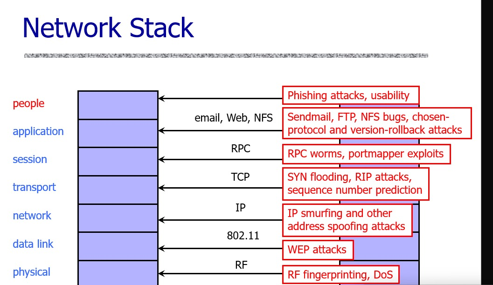

# UNIT-1

- definition and scope of network security
    - strategies + policies + practices desgined to protect network sys + data + services from unauthorized access + misuse + disruption + destruction + modification
    - scope - protection of physical devices, S/W, data and protection of the CIA triad
        - confidentiality
        - integrity
        - availability
        - authentication
        - authorization
        - cryptography
        - wireless security
    - components
        - firewalls - barriers between trusted and utnrusted networks by filterinwhy g incoming + ougoing traffic based on security rules
        - IDS - detect malicious activities within a network
        - IPS - precent malicious activities within a network
        - VPN - securely connect remote users to a network via encrypted tunnels
        - access control - ensures that only authorized users have access to a network resources
        - encryption - secures data in transit and at rest by covnerting it into an unreadable format
        - endpoint security - protects devices connected to networks
        - authentication mechanisms - passwords, MFA, biometrics to verify user identities

> "security in a system is as good as the security of its weakest link"

- levels of impact
    - low
        - limited adverse effect on org's operations, organisational assets, individuals
    - moderate
        - could have serious effect on org's operations, organisational assets, individuals
    - high
        - severe adverse effect on org's operations, organisational assets, individuals

- security services*
    - mechanisms designed to ensure protection of data, systems, and communication in a network
    - implement secuirty policies to achieve confidentiality, integirty, aithentication, and other security goals
    - X.800
        - a service provided by protocol layer of communicatin gopen sys, which ensures adequate security of the systems or of the data transfers
        - consists of
            - authentication
            - access control
            - data confidentiality
            - data integrity
            - non-repudiation
            - availability

- security mechanisms*
    - feature desgined to detect, prevent and recover from attack
    - employs cryptographic techniques
    - types
        - specific
            - encipherment
            - digi signatures
            - access control
            - authentication exhcange
            - routing control
        - pervasive
            - trusted functionality
            - event detection
            - security recovery

- security models + frameworks
    - Bell-LaPadula model
        - maintaining data confidentiality using access controls
        - no-read-up and no-write-down
        - used in military settings
    - Biba model
        - data integrity
        - no-write-up and no-read-down
        - used in commercial settings
    - Clark-Wilson 
        - emphasizes data integirty trhough well-formed transactions and separation of duties
        - suitable for banking applications
    - Zero Trust model
        - assumes that no entity is inherently trusted and requires continuous verification
        - least privilege access, micro-segmentation(division of networks to limit spread of potential breaches, etc.), verify identities of users explicitly
    - NIST
        - core functions include idnetify, protect, detect, repsond and recover
        - used by government agencies and healthcare enterprises
    - MITRE ATT&CK
        - helps identify and classify attacker tactics and techniques used in cyber intrusions

- network attacks
    - active
        - involves the active participation of the malicious actor
        - types
            - spoofing - impersonating a trusted entity
            - DoS - overloading a network to make it unavailable for genuine clients
            - MitM - intercepting + altering communication b/w 2 parties
            - replay attacks - resuing captured data packets to gain unauthorized access
        
        
        
        
    - passive
        - does not involve the active participation of the malicious actor
        - types
            - eavesdropping - intercepting data durinf transmission
            - traffic analysis - observing communication patterns to infer info
        
        
- risk management
    - process of identifying, assessing, mititgating risks to ensure security and resilience of a network
    - steps
        - risk identification
            - objective - identify all assets, threats and vulnerabilites in the network
            - activities - create inventory of H/W, S/W and data; evaluate potential risks
        - risk assessment
            - objective - determine likelihood and impact of identified risks
            - techniques
                - qualititative assessment
                - quantitative assessment
            - outcome - prioritize risks based on their potential effect on network operations
        - risk mitigation
            - objective - implement measures to minimize or elimiate risks
            - strategies
                - preventive measures - deploy firewalls, IPS, etc.
                - detective measures - use monitoring tools like IDPS and log analysis to identify threats early
                - corrective measures - develop incident response plans and backup strategies to recover from security breaches
        - monitoring and review
            - objective - ensure continious effectiveness of security controls
            - activities
                - regularly update security plocies and tools to address emerging threats
                - conduct perioidc vulnerability assessments and penetration tests
                - monitor network traffic and maintain logs
        - risk acceptance or transfer
            - risk acceptance - decide to adcept a certain level of risk is mitigation outweights the potential impact
            - risk transfer - use third party services like cyber insurance to shift the financial burden of specific risks